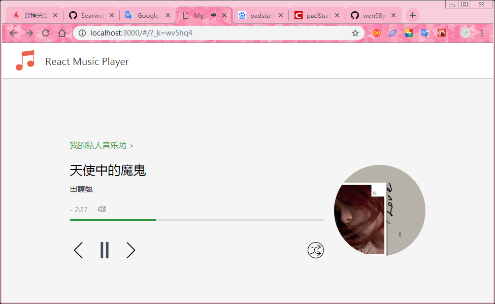
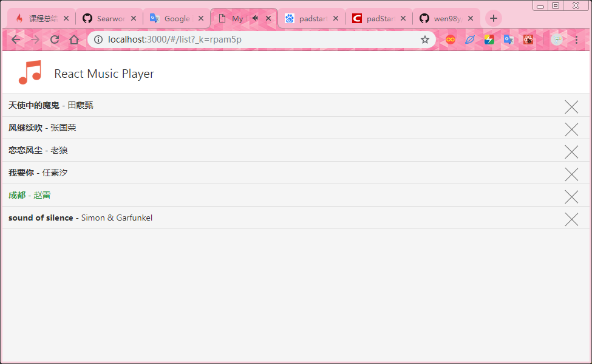
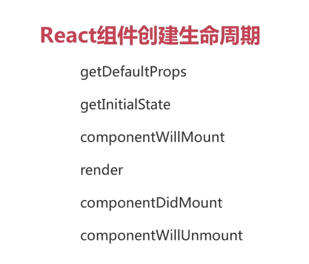
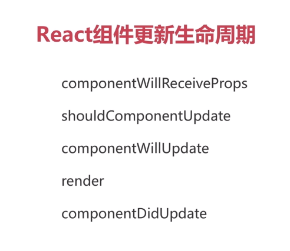

# Reac Music Player

#### 项目介绍
这是在[慕课网](https://www.imooc.com/video/15492)上学的，课程虽然有点久了，用的React 15，但我还是学到挺多东西的。

### overview




### 如何运行

**安装依赖**
```shell
npm install
```

**开发启动**
```shell
npm start
```

### React生命周期


